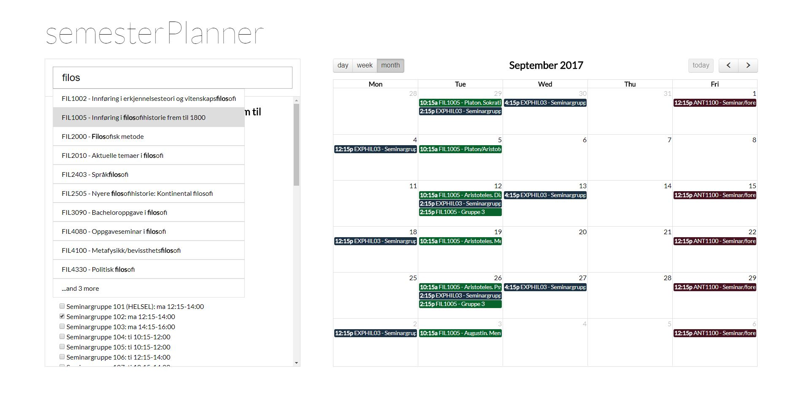

**NOTE: this project is not actively maintained, I created this as a sideproject to learn learn web development when I was first starting out. Feel free to fork or create similar pages with the same concept**

Easier scheduling at the university of oslo

Available at [semesterplanner.xyz](http://www.semesterplanner.xyz) 

Get a visual overlook of your schedule when planning for the next semester

Toggle between month, week, and day-view

Search for any course name or code to add it to the calendar

